# JavaFX
Trabajo realizado por
* Mateo Miño
* Erick Villarroel
* Danny Yanacallo
-----------------------------------
Elementos utilizados:

* Video Converter
  

* JavaFX
  

* Java JDBC Driver
  

* Scene Builder
  

* Intellij
  

* SQL connector
  

* Youtube
  

-----------------------------------
DESARROLLO:

1. Descargar de la página oficial de JavaFX la librería con su controlador (https://openjfx.io/)

   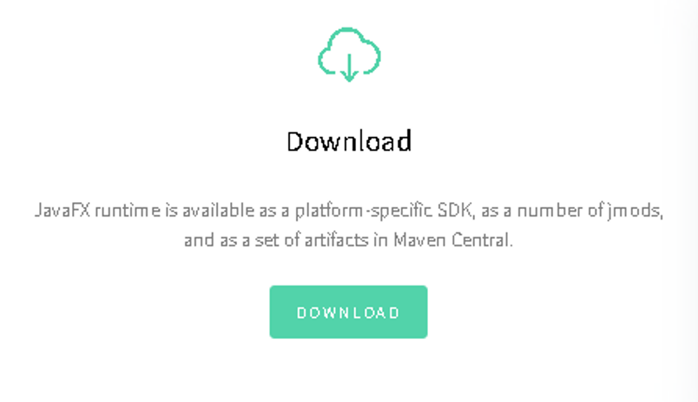

2. Descargar el Controlador Visual “Scene Builder”, que contendrá la interfaz grafica para desarrollar las aplicaciones.

   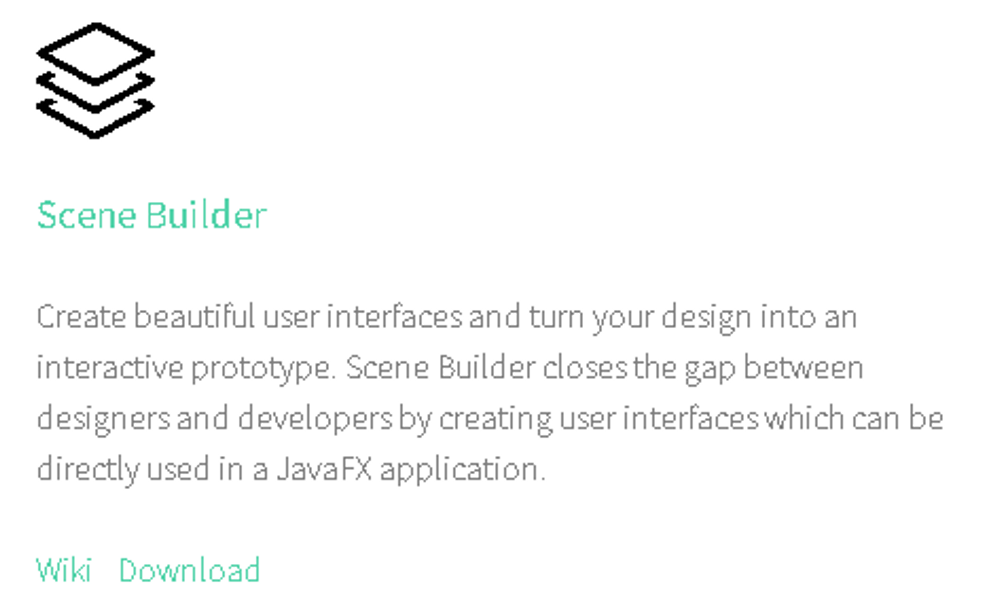

3. Descargar el controlador SQL para Java (https://learn.microsoft.com/en-us/sql/connect/jdbc/download-microsoft-jdbc-driver-for-sql-server?view=sql-server-ver16#download)

   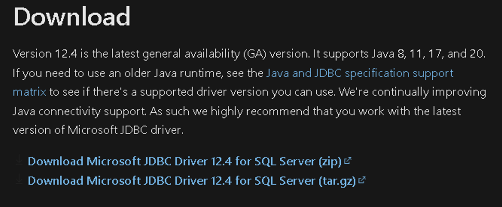

4. En nuestro sistema SQL (en este caso MySQL), crear la base de datos a utilizarse

   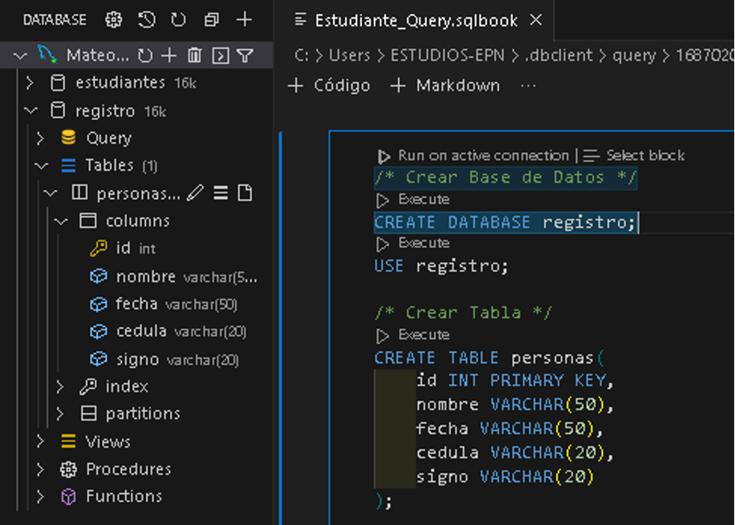

5. Dentro de Intellij Crear un nuevo Proyecto con JavaFX

   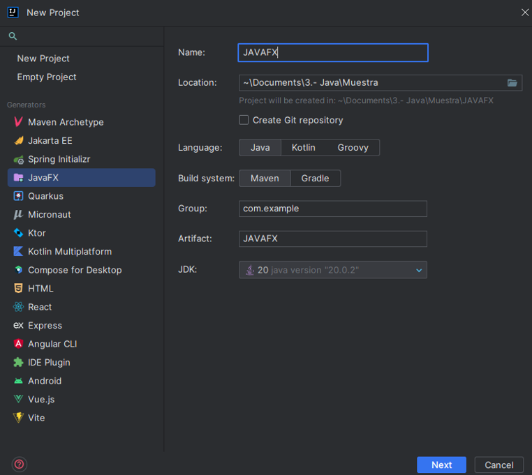

6. Opcional añadimos librerías extra para nuestro proyecto

   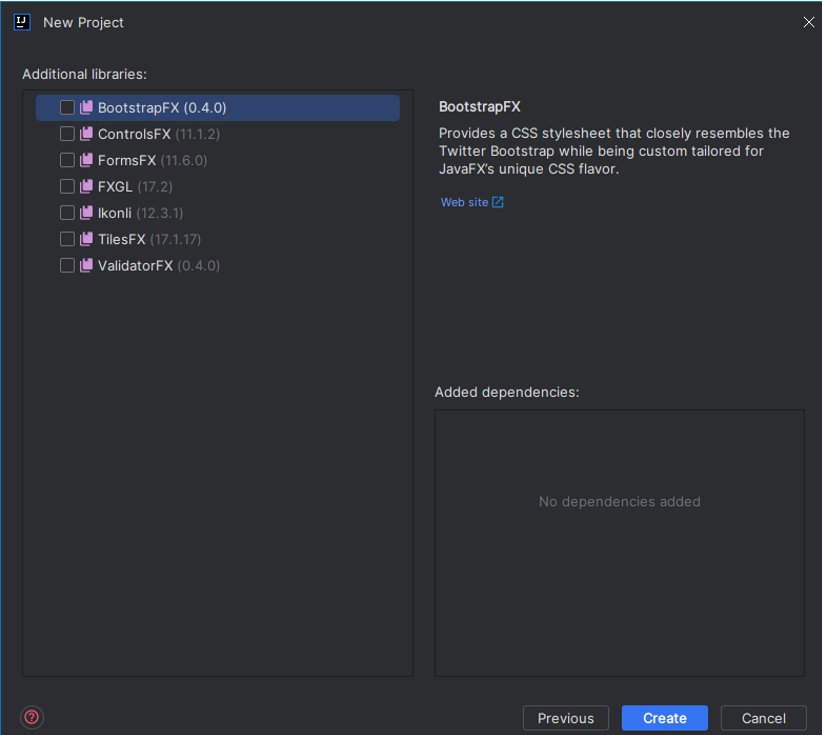

7. Una vez creado el proyecto visualizamos todas las librerías

   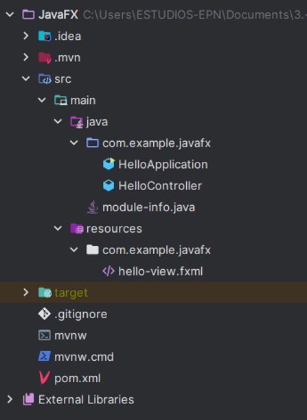

8. Ahora añadimos la librería de SQL a nuestro proyecto

   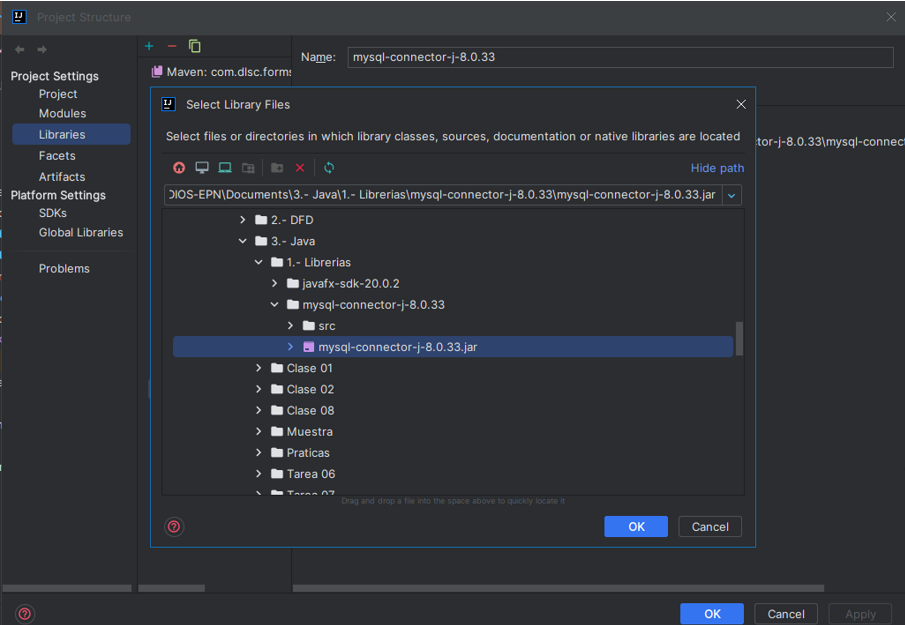

9. Instalamos en nuestro PC el “Scene Builder” y lo guardamos en un sitio accesible

   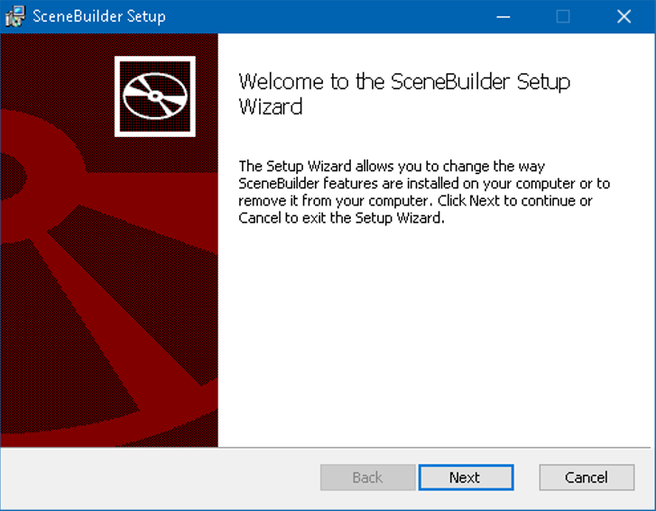

10. En nuestro archivo en Intellij damos click derecho sobre nuestro archivo “.fxml” y abrimos nuestro proyecto en nuestro “Scene Builder”

    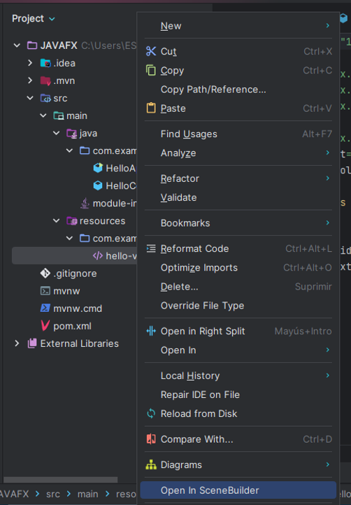

11. Una vez dentro del “Scene Builder” veremos el sistema que tenemos

    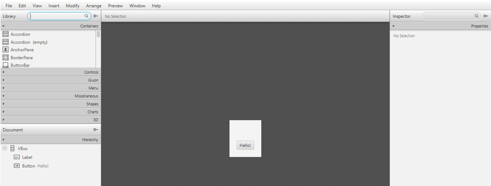

12. Ahora le vamos a dar el formato con sus respectivos id a los elementos para empezar a trabajar.

    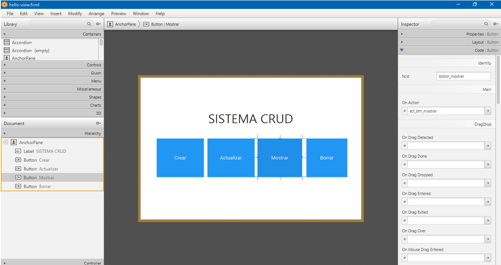

13.	Una vez creada la interfaz grafica copiamos la estructura del controlador y la copiamos en nuestro “Controller” o el archivo que se tenga para controlar.

    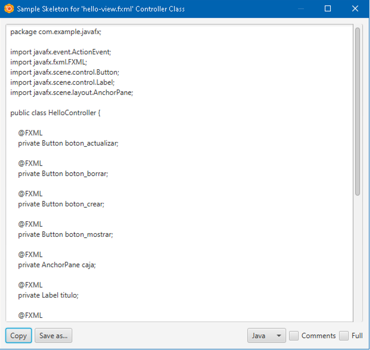

14.	Una vez copiado el código vamos a importar la librería SQL a nuestro proyecto

    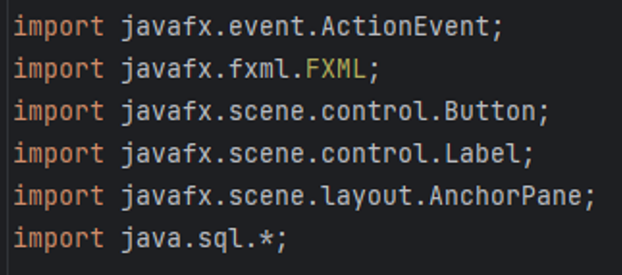
 

